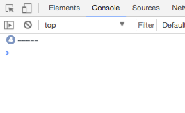

# Javascript Console Calculator

This is a console based calculator, in order to view your results, you will need to enter the developer tools in your browser. You can do this by right clicking in the browser window and selecting `inspect`.

A new panel will open in the browser. Navigate to the console tab to view the results.

If you are unable to open the inspect panel, you will have to close the calculator first. Please see below for instructions on exiting the calculator.

## Features

- ***Basic Calculator*** allows you to do the following, with two numbers:
  - Addition
  - Subtraction
  - Multiplication
  - Division

- ***Advanced Calculator*** allows you to do the following:
  - Multiply one number by the `Power` of another
  - Find the `Square Root` of a number

- ***BMI Calculator***
  - Find your ***Body Mass Index*** (BMI), using your weight and height in kilos and centimetres.

## How To Use Calculator

- Choose which calculator you want with `a` or `b` and hit `Enter`.
- From the selection, type in the relevant letter for the calculation you wish to do and press `enter`.
- Follow the prompts to finish the calculation.

## How To Quit

On the ***Calculator Selection*** prompt, hit `Cancel`, type `n` and then `enter` to exit the calculator.
